# 🎓NITPY's AI Attendance System using Facial Recognition 

Welcome to the **AI Attendance System** project! This repository contains code and resources for a seamless attendance management system powered by **Facial Recognition**. The system leverages **YOLO V8** and a **Siamese Network** to identify students based on their facial features and record their attendance in a **MongoDB Database**. It also includes an **Automatic Mailing Feature**! 📧

---

## 🌟 Features

- **👩‍🎓 Facial Recognition**: Uses YOLO V8 and a Siamese network to accurately identify students.
- **🔑 Student and Faculty Login**: Secure login and signup pages for both students and faculty.
- **📝 Attendance Management**: Automatically logs attendance for recognized faces.
- **⚙️ Settings Page**: Allows users to update their profile information.
- **🗄️ MongoDB Integration**: Stores user data and attendance records securely.
- **🌐 Web Interface**: Built using Flask for an intuitive user experience.

---

## 🛠️ Technology Stack

- **🎨 Frontend**: HTML, CSS, JavaScript
- **⚙️ Backend**: Flask
- **📂 Database**: MongoDB Atlas
- **🤖 AI Models**: Fine-tuned YOLO-V8 and Siamese neural network for facial recognition
- **💻 Programming Languages**: Python

---

## 📂 Project Structure

```plaintext
ai_attendance_system/
|
|-- ai_models/             # Contains AI/ML models for facial recognition
|-- config/                # Configuration files
|-- controllers/           # Controllers to handle business logic
|-- middleware/            # Middleware for authentication and validation
|-- models/                # Database models
|-- outputs/               # Generated output files
|-- routes/                # API route definitions
|-- static/                # Static files (CSS, JS, images)
|-- templates/             # HTML templates for the web interface
|-- test/                  # Test scripts
|-- uploads/               # Directory for uploaded files
|-- .env                   # Environment variables
|-- .gitignore             # Git ignore file
|-- app.py                 # Flask application entry point
|-- config.py              # Configuration script
|-- requirements.txt       # Required Python packages
|-- data/                  # Data files

   ```


---

## 🚀 Setup Instructions

1. **📥 Clone the Repository**
   ```bash
   git clone https://github.com/vasan-rj/NITPY-AI-Attendance.git
   cd ai_attendance_system
   ```

2. **🛠️ Create the Virtual Environment**
   ```bash
   python -m venv myenv
   myenv\Scripts\activate
   ```

3. **📦 Install Dependencies**
   Make sure you have Python 3.8 or higher installed.
   ```bash
   pip install -r requirements.txt
   ```

4. **▶️ Run the Application**
   ```bash
   python app.py
   ```
   The application will be accessible at `http://127.0.0.1:5000/`. 🌐

---

## 🛡️ Usage

1. **👨‍🎓 Student Login**
   - Students can log in to view their attendance records.
   - 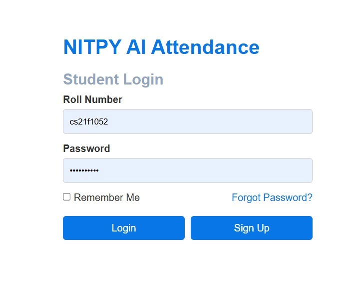
2. **👩‍🏫 Faculty Login**
   - Faculty can log in to manage attendance and update settings.
   - 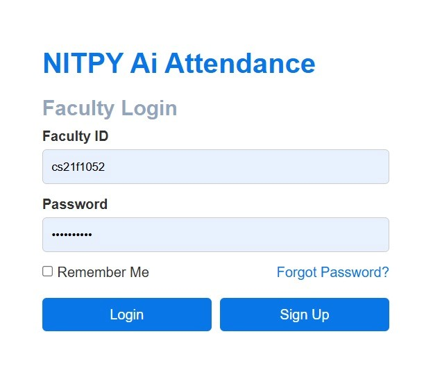
3. **⚙️ Settings Page**
   - Both students and faculty can update their profiles via the settings page.
   - 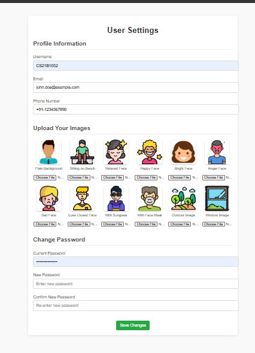
   - 

---

## 📂 Screenshots

 <!--<div >-->
 <!--   <h3>Finane Health Score</h3>-->
 <!--   -->
 <!-- </div>-->
 <!-- <div >-->
 <!--   <h3>Personalized Finance Roadmap</h3>-->
 <!--   -->
 <!-- </div>-->
 <!-- <div >-->
 <!--   <h3>AI Assistant Screen</h3>-->
 <!--   -->
 <!-- </div>-->
 <!-- <div >-->

- **System Architecture**:
  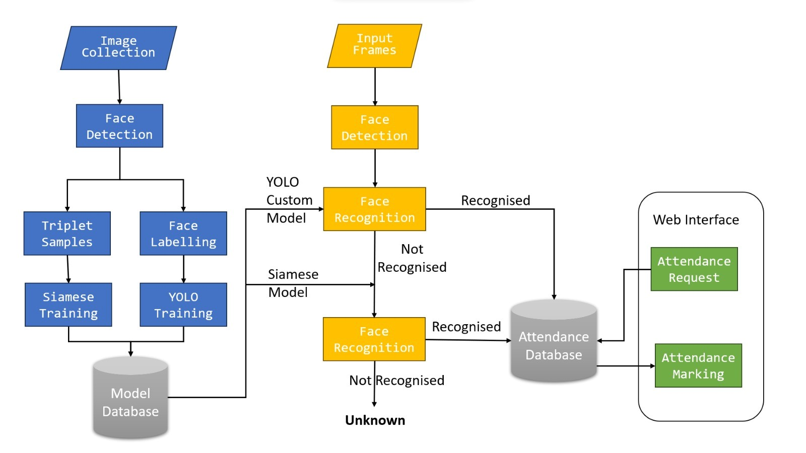
- **Augmented Faces**:
  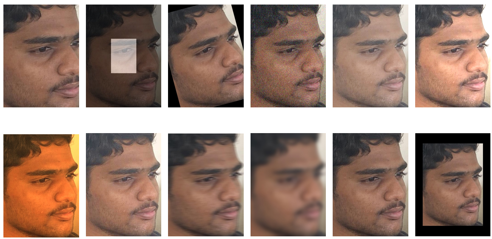
- **Faculty Interface**:
  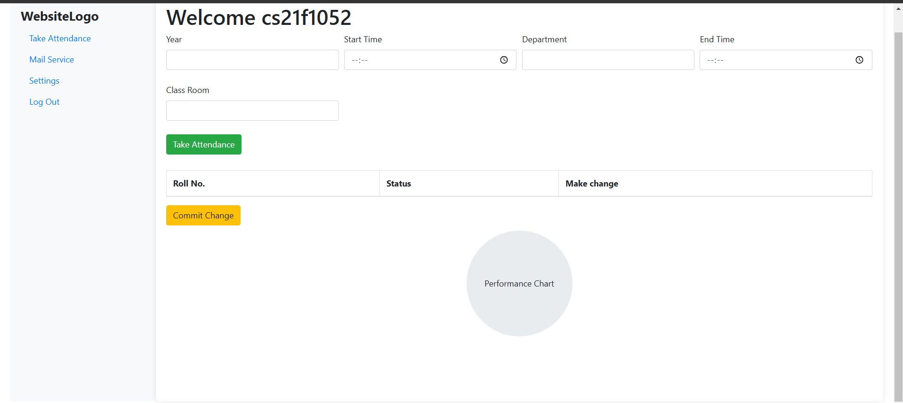
- **Student Interface**:
  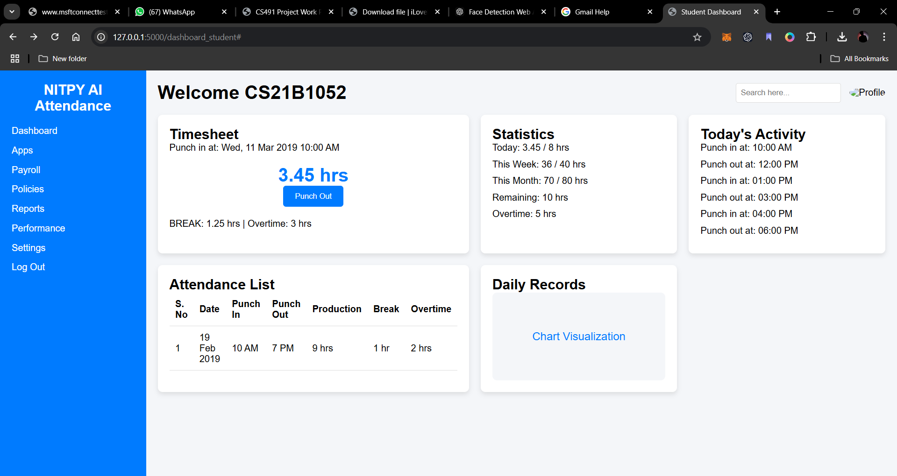
- **Attendance Record**:
  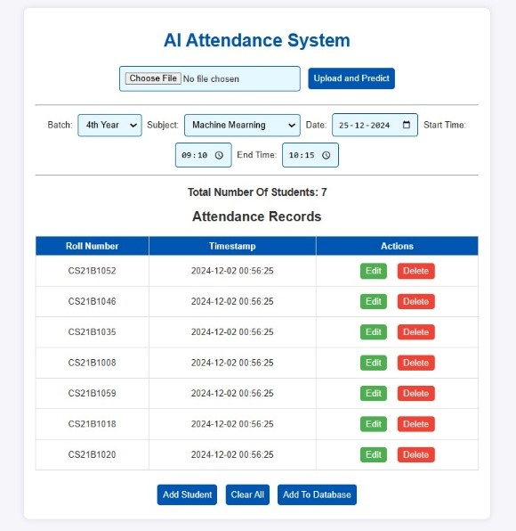
- **YOLO Model Comparison**:
  
- **Sample Input Data**:
  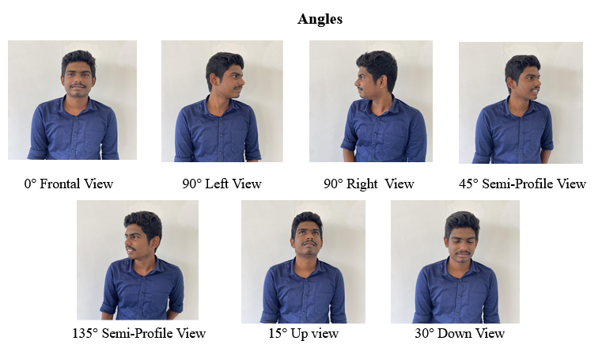
- **Email Notification**:
  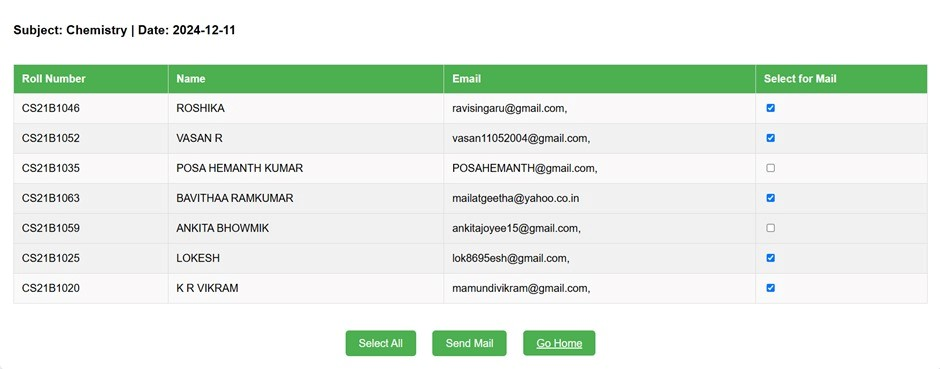
  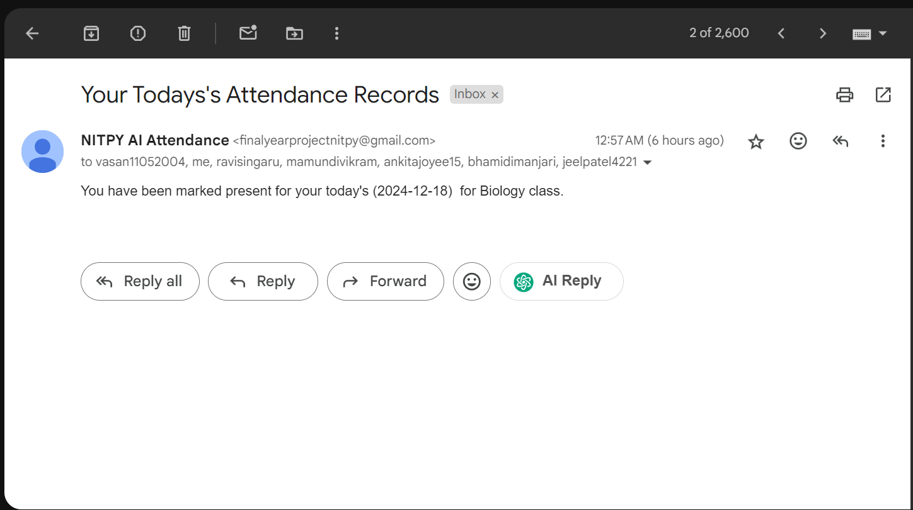

---

## 🛠️ Future Enhancements

- **📹 Real-Time Attendance**: Enable real-time attendance using live camera feeds.
- **🔒 Advanced Authentication**: Add multi-factor authentication for enhanced security.
- **📱 Mobile App**: Develop a companion mobile application for on-the-go access.
- **📊 Analytics Dashboard**: Provide detailed attendance insights and analytics.

---

## 🤝 Contributors

- **Vasan RJ** ([GitHub Profile](https://github.com/vasan-rj))

---

## 📝 License

This project is licensed under the [MIT License](LICENSE). 🛡️

---

## 🙏 Acknowledgments

- Thanks to the **NITPY community** for their support. 🎓
- Special mention to the contributors of the **Python** and **Flask** communities. 💻


